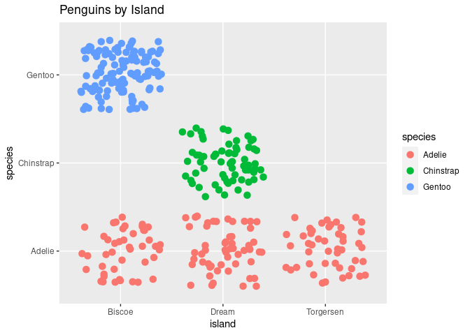

Basic statistics assignment
================
Eric Anjeo
10/11/2020

#### [Link](https://github.com/Museve/p8105_hw1_eriq21)

### ***Problem 0.1***

-   random sample of size 10 from a standard Normal distribution

``` r
set.seed(1234)#for producing same results
x=rnorm(10);
x
```

    ##  [1] -1.2070657  0.2774292  1.0844412 -2.3456977  0.4291247  0.5060559
    ##  [7] -0.5747400 -0.5466319 -0.5644520 -0.8900378

### ***Problem 0.1***

-   a logical vector indicating whether elements of the sample are
    greater than 0

``` r
x>0
```

    ##  [1] FALSE  TRUE  TRUE FALSE  TRUE  TRUE FALSE FALSE FALSE FALSE

### ***Problem 0.1***

-   a character vector of length 10

``` r
chavec=c("one","two","three","four","five","six","seven","eight","nine","ten")
length(chavec)
```

    ## [1] 10

### ***Problem 0.1***

-   a a factor vector of length 10, with 3 different factor “levels”

``` r
facvec=as.factor(c(rep("male",3),rep("female",4),rep("both",3)))
levels(facvec)
```

    ## [1] "both"   "female" "male"

***dataframe***

``` r
dt=data.frame(x=x,charve=chavec,facvec=facvec)
mean(dt$x)
```

    ## [1] -0.3831574

The only mean that we get is for the numeric variable x. The other two
(character and factor) generate errors when called.

### ***Problem 2: palmerpenguins***

``` r
library(dplyr) # data cleaning package
library(corrplot) # for correlation plot
library(GGally) #
library(psych)
data("penguins", package = "palmerpenguins")#reading in the required data
df=penguins#assigning a new name to it
cat("The data has",dim(df)[1],"rows","and",dim(df)[2],"columns")
```

    ## The data has 344 rows and 8 columns

``` r
colnames(df)#it gives the columns names
```

    ## [1] "species"           "island"            "bill_length_mm"   
    ## [4] "bill_depth_mm"     "flipper_length_mm" "body_mass_g"      
    ## [7] "sex"               "year"

``` r
#Summary stats
summary(penguins)
```

    ##       species          island    bill_length_mm  bill_depth_mm  
    ##  Adelie   :152   Biscoe   :168   Min.   :32.10   Min.   :13.10  
    ##  Chinstrap: 68   Dream    :124   1st Qu.:39.23   1st Qu.:15.60  
    ##  Gentoo   :124   Torgersen: 52   Median :44.45   Median :17.30  
    ##                                  Mean   :43.92   Mean   :17.15  
    ##                                  3rd Qu.:48.50   3rd Qu.:18.70  
    ##                                  Max.   :59.60   Max.   :21.50  
    ##                                  NA's   :2       NA's   :2      
    ##  flipper_length_mm  body_mass_g       sex           year     
    ##  Min.   :172.0     Min.   :2700   female:165   Min.   :2007  
    ##  1st Qu.:190.0     1st Qu.:3550   male  :168   1st Qu.:2007  
    ##  Median :197.0     Median :4050   NA's  : 11   Median :2008  
    ##  Mean   :200.9     Mean   :4202                Mean   :2008  
    ##  3rd Qu.:213.0     3rd Qu.:4750                3rd Qu.:2009  
    ##  Max.   :231.0     Max.   :6300                Max.   :2009  
    ##  NA's   :2         NA's   :2

``` r
#plots
psych::pairs.panels(penguins)
```

<!-- -->

### we drop empty observations in sex variable

``` r
penguins <- penguins %>% filter(sex == 'male' | sex == 'female')
summary(penguins)
```

    ##       species          island    bill_length_mm  bill_depth_mm  
    ##  Adelie   :146   Biscoe   :163   Min.   :32.10   Min.   :13.10  
    ##  Chinstrap: 68   Dream    :123   1st Qu.:39.50   1st Qu.:15.60  
    ##  Gentoo   :119   Torgersen: 47   Median :44.50   Median :17.30  
    ##                                  Mean   :43.99   Mean   :17.16  
    ##                                  3rd Qu.:48.60   3rd Qu.:18.70  
    ##                                  Max.   :59.60   Max.   :21.50  
    ##  flipper_length_mm  body_mass_g       sex           year     
    ##  Min.   :172       Min.   :2700   female:165   Min.   :2007  
    ##  1st Qu.:190       1st Qu.:3550   male  :168   1st Qu.:2007  
    ##  Median :197       Median :4050                Median :2008  
    ##  Mean   :201       Mean   :4207                Mean   :2008  
    ##  3rd Qu.:213       3rd Qu.:4775                3rd Qu.:2009  
    ##  Max.   :231       Max.   :6300                Max.   :2009

``` r
penguins %>% group_by(species) %>% tally()
```

    ## # A tibble: 3 × 2
    ##   species       n
    ##   <fct>     <int>
    ## 1 Adelie      146
    ## 2 Chinstrap    68
    ## 3 Gentoo      119

``` r
penguins %>%group_by(species) %>% summarise_if(is.numeric, funs(mean,median)) %>% knitr::kable()
```

| species   | bill_length_mm_mean | bill_depth_mm_mean | flipper_length_mm_mean | body_mass_g\_mean | year_mean | bill_length_mm_median | bill_depth_mm_median | flipper_length_mm_median | body_mass_g\_median | year_median |
|:----------|--------------------:|-------------------:|-----------------------:|------------------:|----------:|----------------------:|---------------------:|-------------------------:|--------------------:|------------:|
| Adelie    |            38.82397 |           18.34726 |               190.1027 |          3706.164 |  2008.055 |                 38.85 |                18.40 |                      190 |                3700 |        2008 |
| Chinstrap |            48.83382 |           18.42059 |               195.8235 |          3733.088 |  2007.971 |                 49.55 |                18.45 |                      196 |                3700 |        2008 |
| Gentoo    |            47.56807 |           14.99664 |               217.2353 |          5092.437 |  2008.067 |                 47.40 |                15.00 |                      216 |                5050 |        2008 |

### Penguins distributions

``` r
table(penguins$species, penguins$island)
```

    ##            
    ##             Biscoe Dream Torgersen
    ##   Adelie        44    55        47
    ##   Chinstrap      0    68         0
    ##   Gentoo       119     0         0

``` r
chisq.test(table(penguins$species, penguins$island)) # meaningful difference
```

    ## 
    ##  Pearson's Chi-squared test
    ## 
    ## data:  table(penguins$species, penguins$island)
    ## X-squared = 284.59, df = 4, p-value < 2.2e-16

``` r
ggplot(penguins, aes(x = island, y = species, color = species)) +
  geom_jitter(size = 3)  +ggtitle('Penguins by Island')
```

<!-- -->
